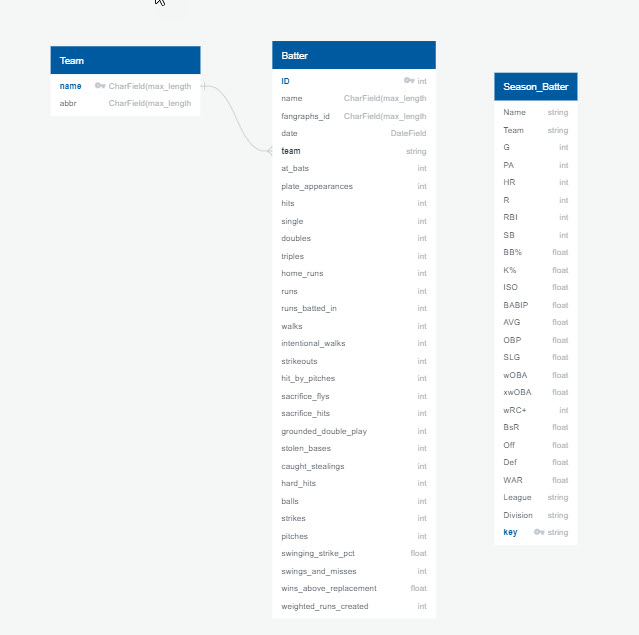

# Basewinner Offense

This app enables you to navigate to three different React tables to access standard MLB stats as well as unique and proprietary MLB stats we have procured.

https://basewinner-stat-tables.herokuapp.com/

## Database Schema and API

The raw data that is used in this project is scraped from fangraphs.com. We use Pandas to transform the some of raw data into Basewinner ratings and numbers.

We use Python on the back end to compile and store some of the ratings. The data is stored in a SQlite database. The ORM used is Peewee.

Here is the database schema for the table.

### Links to API

Season batting : https://basewinner.com/batting/batters.json

By Week batting : https://www.basewinner.com/batting/aggregated_batting.json
